<p align="center">
  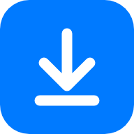
</p>

<h1 align="center">Syno Debrid</h1>

<p align="center">
  Un lien magnet ou un fichier <code>.torrent</code> passe par votre service debrid, et les fichiers
  arrivent dans <b>Download Station</b> sur votre Synology, dans le bon dossier.
</p>

<p align="center">
  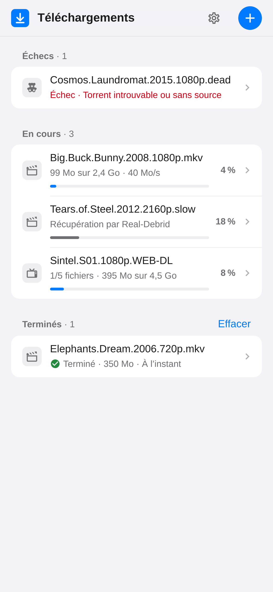
  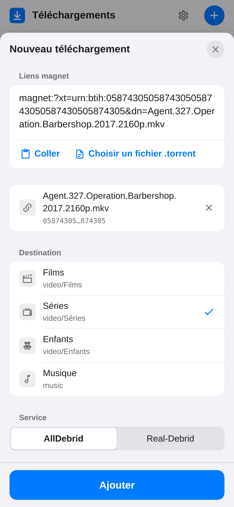
  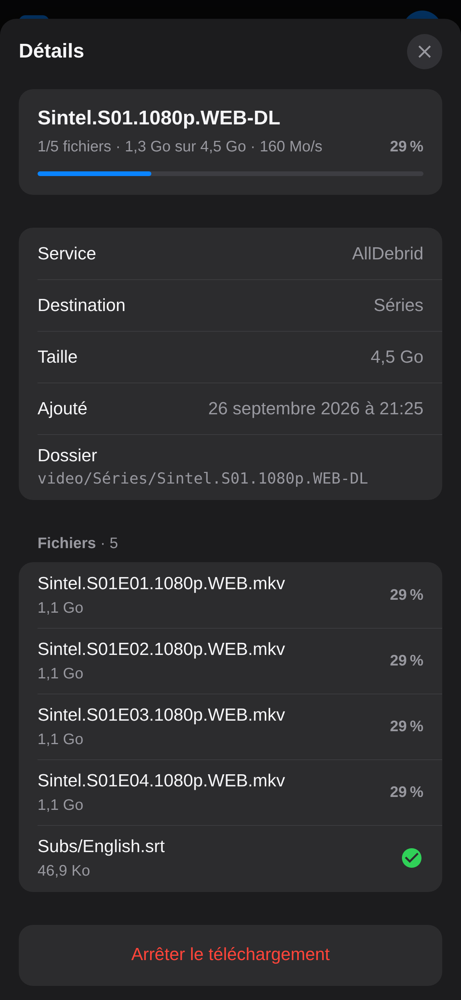
</p>
<p align="center">
  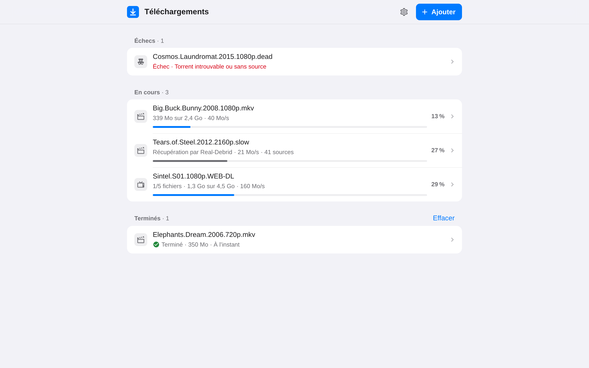
</p>

<details>
<summary>Plus de captures</summary>

<p align="center">
  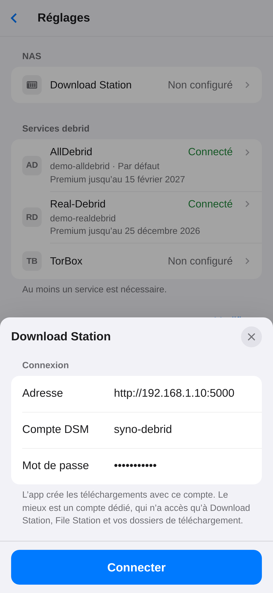
  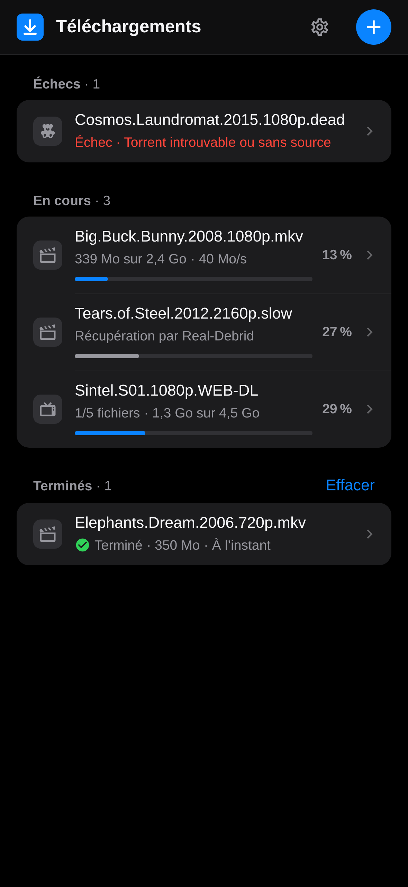
  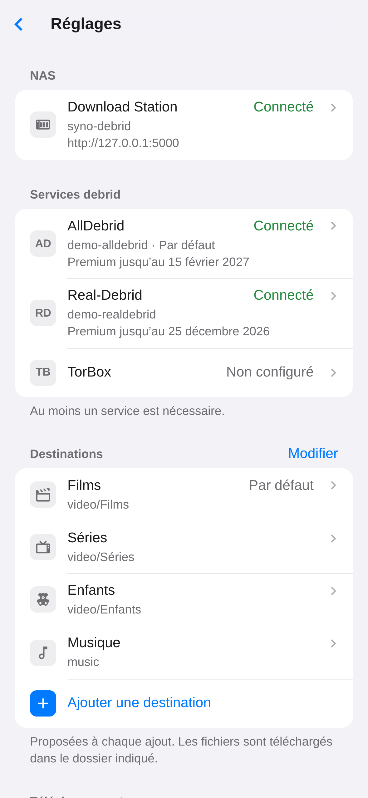
</p>
<p align="center">
  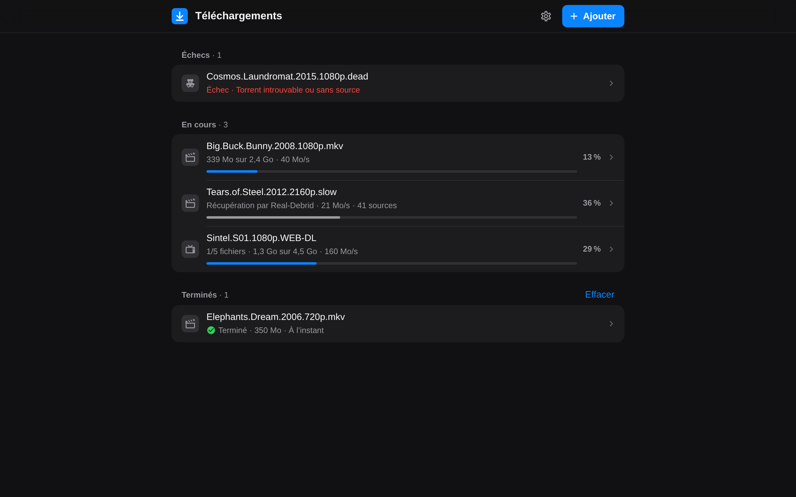
  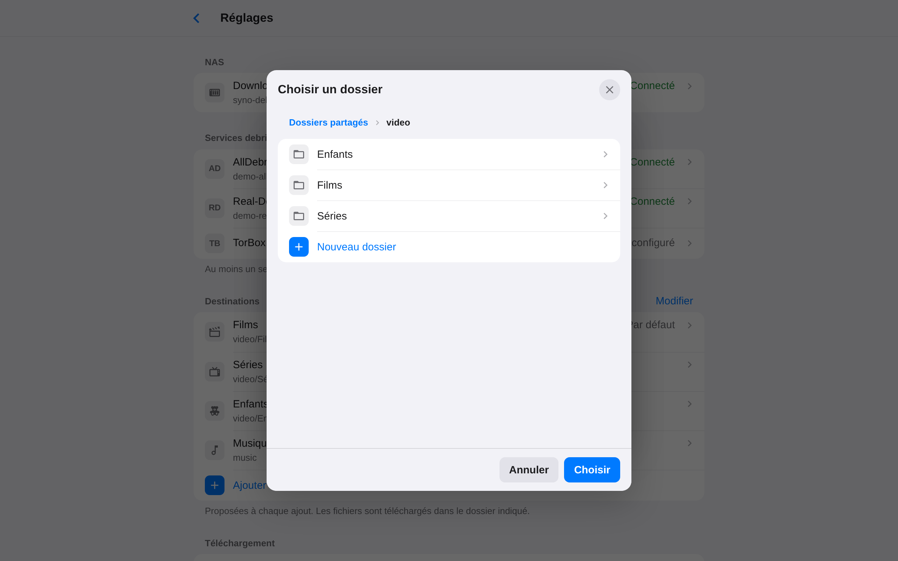
</p>

</details>

## Fonctionnalités

- **AllDebrid, Real-Debrid et TorBox.** Le service debrid récupère le torrent, puis le NAS
  télécharge les fichiers en HTTPS. Le NAS ne fait jamais de P2P.
- **Liens magnet** (un ou plusieurs à la fois), hash, ou **fichiers `.torrent`** : glisser-déposer
  sur ordinateur, app Fichiers sur iPhone.
- **Le bon dossier.** Des destinations (Films → `video/Films`, Séries → `video/Séries`…) se créent
  en parcourant les dossiers du NAS, un nouveau dossier pouvant être créé au passage ; il suffit
  d'en choisir une à chaque ajout. Le dernier choix est mémorisé.
- **Comme un client BitTorrent.** Un torrent à plusieurs fichiers arrive dans son propre dossier,
  avec ses sous-dossiers.
- **Suivi en direct.** Progression chez le service debrid puis dans Download Station, fichier par
  fichier, avec possibilité de réessayer ou d'arrêter.
- **Un compte pour l'app, un compte DSM pour Download Station.** On se connecte à l'app avec son
  propre mot de passe, ou sans mot de passe derrière un proxy qui authentifie (Authelia…). Les
  téléchargements sont créés avec un compte DSM choisi dans les réglages, idéalement un compte
  dédié. L'app s'y reconnecte seule : les téléchargements continuent sans personne.
- **Pensé pour l'iPhone.** L'app s'installe sur l'écran d'accueil, passe en mode sombre
  automatiquement, et existe en français et en anglais.
- **Léger.** Une image Docker d'environ 60 Mo (amd64 et arm64), sans base de données.

## Comment ça marche

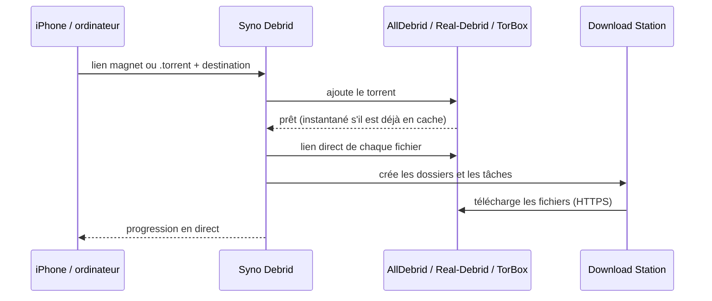

## Installation sur un Synology

Prérequis : DSM 7.2 ou plus récent, avec **Container Manager** et **Download Station** (installés
depuis le Centre de paquets).

1. Dans **File Station**, créer un dossier `docker/syno-debrid`.
2. Dans **Container Manager**, ouvrir **Projet → Créer** et remplir :
   - nom : `syno-debrid` ;
   - chemin : le dossier créé à l'étape 1 ;
   - source : « Créer docker-compose.yml ».

   Coller ensuite le contenu de [`docker-compose.yml`](docker-compose.yml).

3. Valider : l'image est téléchargée et le conteneur démarre.
4. Ouvrir **`http://IP-DU-NAS:8080`** et créer le compte de l'app.
5. L'écran d'accueil liste ce qu'il reste à faire, depuis les **Réglages** (⚙︎) :
   - connecter Download Station : adresse du NAS (`http://IP-DU-NAS:5000`), compte DSM et mot de
     passe ;
   - coller la clé API du service debrid ;
   - ajouter les destinations.

Le premier qui ouvre l'app crée le compte : faire cette étape avant d'ouvrir l'accès depuis
l'extérieur.

### Un compte DSM dédié (conseillé)

L'app n'a besoin que de Download Station et des dossiers de téléchargement. Un compte à part
limite ce qu'elle peut faire sur le NAS :

1. **Panneau de configuration** → **Utilisateur et groupe** → **Créer** : par exemple
   `syno-debrid`, avec un mot de passe fort.
2. **Dossiers partagés** : lecture/écriture sur les dossiers de destination (`video`…),
   aucun accès aux autres.
3. **Applications** : n'autoriser que **Download Station** et **File Station**.

Les fichiers téléchargés appartiennent alors à ce compte ; les droits des dossiers partagés
restent ceux du NAS.

`PUID` et `PGID` indiquent à qui appartiennent les fichiers de `./data`. `1026:100` correspond au
premier utilisateur créé sur le NAS et au groupe `users` ; la commande `id`, en SSH, permet de le
vérifier.

Ailleurs qu'avec Container Manager, `docker compose up -d` suffit.

## Mise à jour

Dans **Container Manager** :

1. **Projet** → `syno-debrid` → **Action** → **Arrêter**, puis **Nettoyer** : le conteneur est
   supprimé, pas les réglages.
2. **Image** : supprimer `ghcr.io/piitaya/syno-debrid`.
3. **Projet** → `syno-debrid` → **Action** → **Construire** : la dernière image est téléchargée et
   l'app redémarre.

Ailleurs : `docker compose pull && docker compose up -d`.

Compte, réglages, clés API, sessions et téléchargements en cours sont dans le dossier `data` du
projet : c'est lui qu'il faut sauvegarder. Il contient aussi le mot de passe chiffré du compte
DSM et sa clé : la sauvegarde doit rester privée.

## Configuration

Le compte, la connexion à Download Station, les clés API et les destinations se règlent dans
l'app. Le reste passe par des variables d'environnement.

| Variable                                                    | Par défaut      | Rôle                                                                                   |
| ----------------------------------------------------------- | --------------- | -------------------------------------------------------------------------------------- |
| `ALLDEBRID_API_KEY`, `REALDEBRID_API_KEY`, `TORBOX_API_KEY` | vide            | Clés API. Si elles sont définies ici, elles ne sont plus modifiables dans l'interface. |
| `PUID` / `PGID`                                             | `1000` / `1000` | Propriétaire des fichiers de `/data`.                                                  |
| `PORT`                                                      | `8080`          | Port HTTP du conteneur.                                                                |
| `TRUST_PROXY`                                               | `false`         | Fait confiance à `X-Forwarded-For` (derrière un proxy inversé).                        |
| `AUTH`                                                      | `password`      | `none` : pas de connexion à l'app, un proxy inversé s'en charge (voir plus bas).       |
| `SESSION_TTL_DAYS`                                          | `30`            | Déconnexion après ce nombre de jours sans ouvrir l'app.                                |
| `LOG_LEVEL`                                                 | `info`          | `debug`, `info`, `warn` ou `error`.                                                    |

Les données (compte, réglages, sessions, historique) sont stockées dans `/data`, dans des
fichiers JSON lisibles uniquement par leur propriétaire, avec `secret.key`, la clé qui chiffre le
mot de passe du compte DSM.

## Comptes et sécurité

- **Compte de l'app.** Il est créé au premier lancement, avec un mot de passe de 8 caractères au
  moins, que l'on peut changer dans les Réglages ; les autres appareils sont alors déconnectés.
  On reste connecté tant qu'on ouvre l'app au moins une fois tous les 30 jours.
- **Mot de passe oublié.** Supprimer `account.json` du dossier `data`, puis redémarrer le
  conteneur : l'app propose de recréer le compte. Réglages, connexion à Download Station et
  téléchargements sont conservés.
- **Compte DSM.** Il lui faut **Download Station**, **File Station** (pour parcourir et créer les
  dossiers) et l'écriture dans les dossiers de destination. L'app garde son mot de passe,
  **chiffré**, pour se reconnecter quand DSM coupe la session (au bout de 7 jours, ou au
  redémarrage du NAS).
- **Mot de passe DSM changé.** L'app essaie une seule fois l'ancien, puis attend : les nouveaux
  téléchargements passent « En attente de Download Station » jusqu'à ce que le nouveau mot de
  passe soit saisi dans Réglages → Download Station. Ceux déjà confiés à Download Station
  continuent.
- **Validation en deux étapes.** Si le compte DSM l'utilise, le code n'est demandé qu'une fois,
  lors de la connexion à Download Station.
- **Blocage automatique de DSM.** Par défaut, DSM bloque une adresse IP après 10 échecs de
  connexion en 5 minutes, et toutes les connexions à DSM viennent du conteneur. L'app limite donc
  ses propres échecs auprès de DSM (6 par tranche de 5 minutes) et ne réessaie jamais un mot de
  passe refusé. Les connexions à l'app, elles, ne passent pas par DSM : 5 échecs par quart d'heure
  et par adresse IP.

## Sur iPhone

- **Écran d'accueil.** Dans Safari : Partager → « Sur l'écran d'accueil ».
- **Lien magnet.** Le copier, toucher **+**, puis **Coller** (disponible en HTTPS) ou appui long
  dans le champ.
- **Fichier `.torrent`.** Le bouton **Choisir un fichier .torrent** ouvre l'app Fichiers.
- **Depuis la feuille de partage** (facultatif). Dans l'app Raccourcis, créer un raccourci qui :
  1. reçoit des URL ou du texte depuis la feuille de partage ;
  2. les passe dans **Encoder l'URL** ;
  3. ouvre `https://votre-adresse/?magnet=` suivi du résultat.

  L'app s'ouvre alors sur la fenêtre d'ajout, avec le lien déjà rempli.

- **Sur ordinateur** (en HTTPS), Réglages → « Ouvrir les liens magnet avec cette app » : un clic
  sur un lien magnet ouvre alors l'app pré-remplie. Coller un lien ou déposer un `.torrent`
  n'importe où dans la page fonctionne aussi.

## Accès depuis l'extérieur

Le plus simple et le plus sûr est un VPN : Tailscale, ou le paquet VPN Server.

Sinon, utiliser le proxy inversé de DSM avec HTTPS : Panneau de configuration → Portail de
connexion → Avancé → Proxy inversé. Source `https://debrid.mondomaine.fr`, destination
`http://localhost:8080`, puis ajouter `TRUST_PROXY=true` au conteneur. Créer le compte de l'app
avant d'ouvrir cet accès.

### Sans mot de passe (Authelia…)

Avec `AUTH=none`, l'app ne demande plus de compte : c'est le proxy inversé qui décide qui entre,
par exemple avec Authelia ou Authentik. Le proxy inversé de DSM ne sait pas authentifier (il ne
filtre que des adresses IP) : il faut un autre proxy, comme Nginx Proxy Manager, Traefik ou
Caddy.

L'app doit alors n'être joignable **que par ce proxy** : ne pas publier le port `8080` sur le
réseau (le mettre sur le même réseau Docker que le proxy, ou publier `127.0.0.1:8080:8080`).

## Bon à savoir

- **Real-Debrid.**
  - Quand le torrent contient de la vidéo ou de l'audio, seuls ces fichiers sont récupérés. Sinon,
    Real-Debrid regroupe tout dans une archive RAR.
  - Un torrent déjà présent sur le compte est réutilisé plutôt qu'ajouté une seconde fois.
- **TorBox.**
  - Ses liens ne contiennent pas le nom du fichier. Si Download Station en choisit un autre, l'app
    renomme le fichier une fois le téléchargement terminé.
  - Ses liens contiennent aussi un jeton, visible dans Download Station.
  - TorBox limite la génération de liens (environ 20 par minute) : un gros pack met un peu de temps
    à partir.
- **AllDebrid** refuse les adresses IP de serveurs et de VPN : l'app doit tourner à domicile, et
  le NAS convient parfaitement.
- **Adresse du NAS.**
  - Depuis le conteneur, `localhost` ne désigne pas le NAS : utiliser son adresse IP.
  - Si DSM redirige HTTP vers HTTPS, indiquer directement l'adresse HTTPS (port 5001), en
    activant « Certificat auto-signé » si besoin.

## Développement

```bash
npm install
npm run demo          # tout-en-un : http://localhost:5173, avec un faux NAS et des exemples
```

`npm run demo` lance l'interface (rechargement à chaud), l'API et des simulations du NAS et des
services debrid, avec des réglages et des téléchargements d'exemple. On s'y connecte avec
`demo` / `demo1234`. Avec `DEMO_SEED=0`, l'app démarre comme au premier lancement ; comptes du
faux NAS pour connecter Download Station :

- `syno-debrid` / `syno-debrid`, `admin` / `admin` ou `paul` / `paul` ;
- `secure` / `secure` : validation en deux étapes, code `123456`.

Pour travailler avec un vrai NAS, copier `.env.example` en `.env` puis lancer `npm run dev` (API
sur :8080, interface sur http://localhost:5173) : l'adresse du NAS se saisit dans l'app. Les
adresses des services debrid sont intégrées. `npm run dev:mock` lance seulement les simulations,
sur le port 5055 (lignes « Without a NAS » de `.env.example`).

```bash
npm test              # tests (Vitest)
npm run lint && npm run typecheck
npm run build && npm start
npm run screenshots   # régénère les captures du README (Chromium)
```

Stack : Node.js 24, TypeScript, [Hono](https://hono.dev) côté serveur,
[Lit](https://lit.dev) et [Vite](https://vite.dev) côté interface.

| Dossier              | Contenu                                                              |
| -------------------- | -------------------------------------------------------------------- |
| `src/server/`        | API, compte, connexion au NAS, suivi des téléchargements (`jobs.ts`) |
| `src/server/nas/`    | Client DSM : connexion, Download Station, File Station               |
| `src/server/debrid/` | AllDebrid, Real-Debrid, TorBox                                       |
| `src/web/`           | Interface (composants Lit)                                           |
| `src/shared/`        | Types de l'API, lecture des liens magnet et des `.torrent`           |
| `test/`              | Tests, et simulations du NAS et des services debrid (`test/mocks/`)  |

Les images Docker (amd64 et arm64) sont construites par GitHub Actions et publiées sur
`ghcr.io/piitaya/syno-debrid` à chaque push sur `main` et à chaque tag `v*`.

## État du projet

L'app a été essayée sur un vrai NAS Synology avec AllDebrid. Elle est aussi testée de bout en bout
contre des simulations des API : DSM, Download Station, File Station, AllDebrid, Real-Debrid et
TorBox. Ces simulations s'appuient sur la documentation officielle et sur le code de clients
existants. Real-Debrid et TorBox n'ont pas encore été essayés avec de vrais comptes : les retours
sont les bienvenus.

Syno Debrid n'est ni affilié à Synology, ni soutenu par Synology. Synology, DSM et Download Station
sont des marques de Synology Inc.
