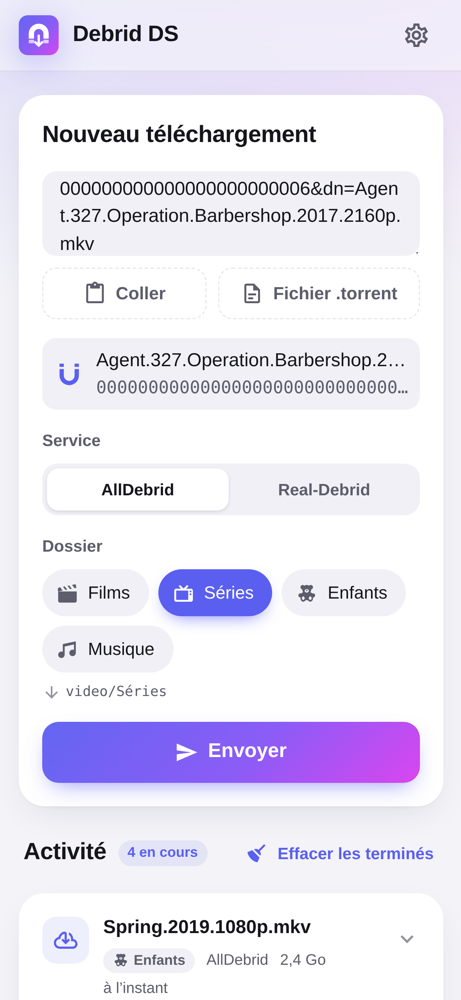
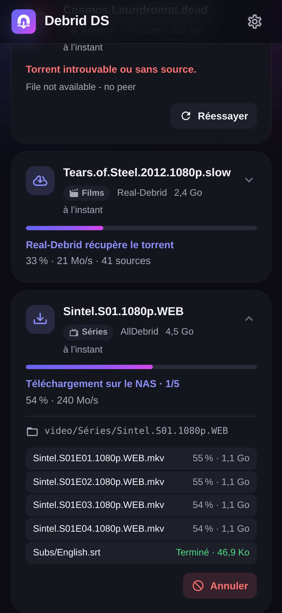
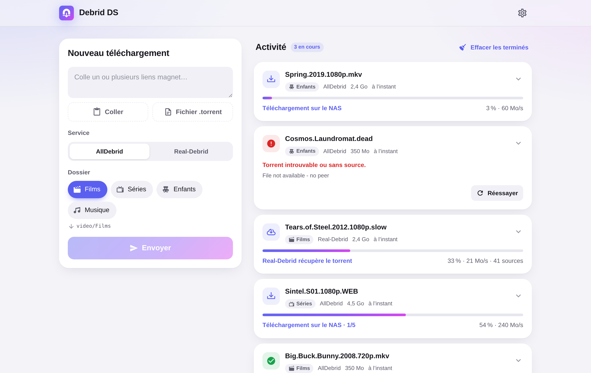
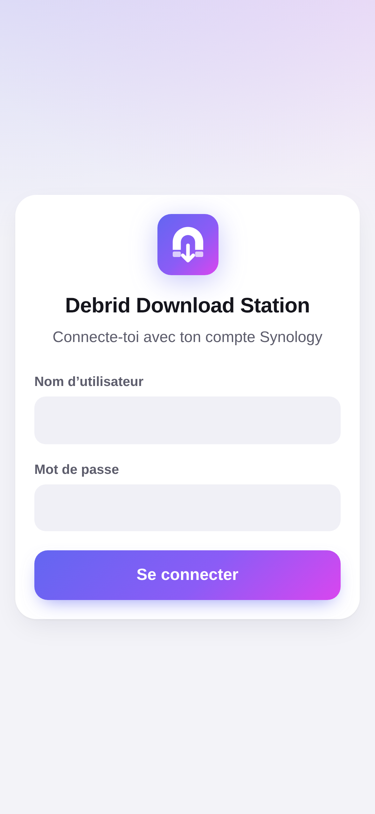
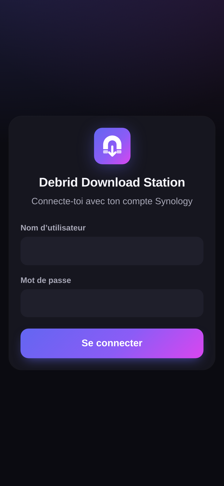
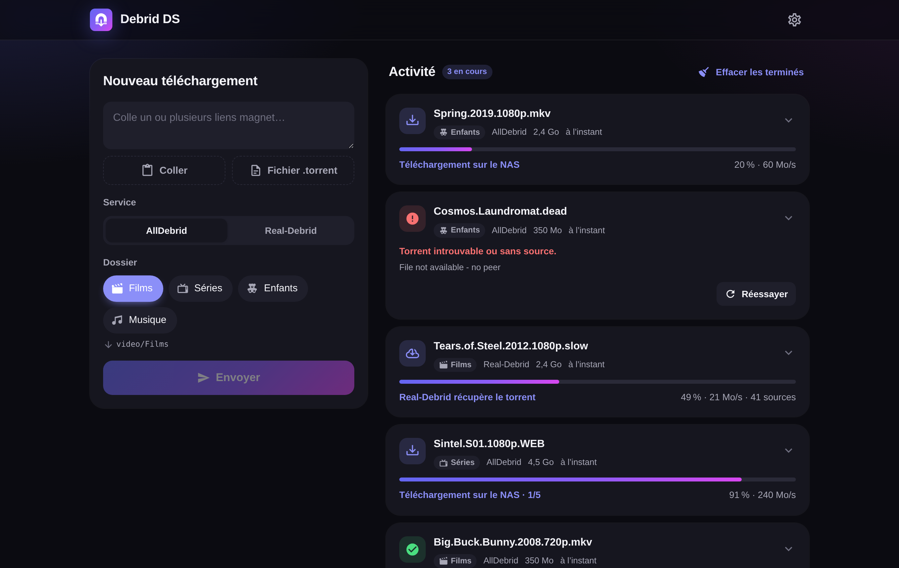
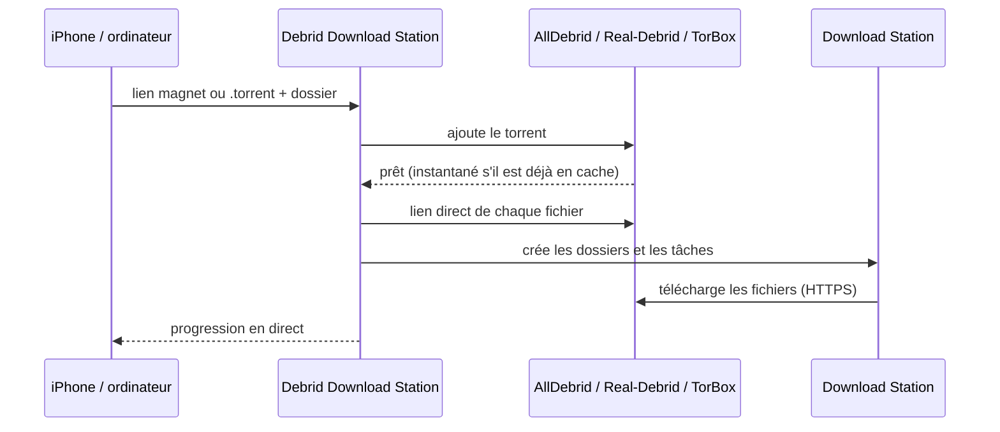

<p align="center">
  
</p>

<h1 align="center">Debrid Download Station</h1>

<p align="center">
  Colle un lien magnet ou dépose un fichier <code>.torrent</code> : ton service debrid le récupère,
  et les fichiers arrivent dans <b>Download Station</b> sur ton Synology, dans le bon dossier.
</p>

<p align="center">
  
  
  
</p>
<p align="center">
  
</p>

<details>
<summary>Plus de captures</summary>

<p align="center">
  
  
</p>
<p align="center">
  
  
</p>

</details>

## Fonctionnalités

- **AllDebrid, Real-Debrid et TorBox.** Ton service debrid récupère le torrent, puis ton NAS
  télécharge les fichiers en HTTPS. Le NAS ne fait jamais de P2P.
- **Liens magnet** (un ou plusieurs à la fois), hash, ou **fichiers `.torrent`**. Sur ordinateur,
  tu peux glisser-déposer le fichier ; sur iPhone, le choisir dans l'app Fichiers.
- **Le bon dossier.** Tu crées tes catégories (Films → `video/Films`, Séries → `video/Séries`…)
  en parcourant les dossiers du NAS, puis tu en choisis une à chaque ajout. Le dernier choix est
  mémorisé.
- **Comme un client BitTorrent.** Un torrent à plusieurs fichiers arrive dans son propre dossier,
  avec ses sous-dossiers.
- **Suivi en direct.** Tu vois la progression chez le service debrid puis dans Download Station,
  fichier par fichier, et tu peux réessayer ou annuler.
- **Connexion avec ton compte Synology.** La validation en deux étapes est gérée et l'appareil est
  mémorisé. Les tâches sont créées avec ton compte, donc tu les retrouves dans Download Station.
- **Pensé pour l'iPhone.** L'app s'installe sur l'écran d'accueil, passe en mode sombre
  automatiquement, et existe en français et en anglais.
- **Léger.** Une image Docker d'environ 60 Mo (amd64 et arm64), sans base de données.

## Comment ça marche



## Installation sur un Synology

Il te faut DSM 7.2 ou plus récent, avec **Container Manager** et **Download Station** (installés
depuis le Centre de paquets).

1. Dans **File Station**, crée un dossier `docker/debrid-download-station`.
2. Dans **Container Manager**, va dans **Projet → Créer** et remplis :
   - nom : `debrid-download-station` ;
   - chemin : le dossier que tu viens de créer ;
   - source : « Créer docker-compose.yml ».

   Colle ensuite le contenu de [`docker-compose.yml`](docker-compose.yml) et remplace
   `192.168.1.10` par l'adresse IP de ton NAS.

3. Valide. L'image est téléchargée et le conteneur démarre.
4. Ouvre **`http://IP-DU-NAS:8080`** et connecte-toi avec ton compte DSM.
5. Dans les **Réglages** (⚙︎), colle la clé API de ton service debrid, puis ajoute tes dossiers.

`PUID` et `PGID` indiquent à qui appartiennent les fichiers de `./data`. `1026:100` correspond au
premier utilisateur créé sur le NAS et au groupe `users` ; pour le vérifier, lance `id` en SSH.

Ailleurs qu'avec Container Manager, `docker compose up -d` suffit.

## Configuration

Tout se règle par variables d'environnement. Les clés API et les dossiers peuvent aussi se régler
depuis la page Réglages.

| Variable                                                    | Par défaut          | Rôle                                                                                      |
| ----------------------------------------------------------- | ------------------- | ----------------------------------------------------------------------------------------- |
| `SYNOLOGY_URL`                                              | **obligatoire**     | Adresse de DSM vue depuis le conteneur, par exemple `http://192.168.1.10:5000`.           |
| `SYNOLOGY_INSECURE_TLS`                                     | `false`             | Accepte le certificat auto-signé de DSM, en HTTPS.                                        |
| `ALLDEBRID_API_KEY`, `REALDEBRID_API_KEY`, `TORBOX_API_KEY` | vide                | Clés API. Si elles sont définies ici, elles ne sont plus modifiables dans l'interface.    |
| `ALLOWED_USERS`                                             | tous                | Comptes DSM autorisés à se connecter, séparés par des virgules.                           |
| `ADMIN_USERS`                                               | administrateurs DSM | Comptes autorisés à modifier les réglages.                                                |
| `PUID` / `PGID`                                             | `1000` / `1000`     | Propriétaire des fichiers de `/data`.                                                     |
| `PORT`                                                      | `8080`              | Port HTTP du conteneur.                                                                   |
| `TRUST_PROXY`                                               | `false`             | Fait confiance à `X-Forwarded-For` (derrière un proxy inversé).                           |
| `SESSION_TTL_DAYS`                                          | `30`                | Durée maximale d'une session. DSM fait de toute façon expirer ses sessions après 7 jours. |
| `LOG_LEVEL`                                                 | `info`              | `debug`, `info`, `warn` ou `error`.                                                       |

Les données (réglages, sessions, historique) sont stockées dans `/data`, dans des fichiers JSON
lisibles uniquement par leur propriétaire.

## Comptes et droits

- **Connexion.** Chacun se connecte avec **son propre compte DSM**. Ce compte doit avoir accès à
  **Download Station**, et à **File Station** pour parcourir les dossiers et créer les
  sous-dossiers. Il lui faut aussi le droit d'écriture dans les dossiers de destination.
- **Réglages.** Ils sont réservés aux administrateurs DSM, ou aux comptes listés dans
  `ADMIN_USERS`.
- **Mot de passe.** Il n'est **jamais stocké** : l'app garde uniquement la session DSM, côté
  serveur.
- **Expiration de la session.** DSM fait expirer ses sessions au bout de 7 jours. Il faut alors
  se reconnecter, et le trousseau iCloud remplit le formulaire tout seul. Les téléchargements déjà
  lancés continuent. Un torrent encore chez le service debrid attend ta prochaine connexion pour
  partir vers le NAS.
- **Validation en deux étapes.** Le code n'est demandé qu'une fois ; ensuite l'appareil est
  mémorisé.
- **Blocage automatique de DSM.** Par défaut, DSM bloque une adresse IP après 10 échecs de
  connexion en 5 minutes. Comme toutes les connexions passent par le conteneur, l'app limite
  elle-même les échecs : 5 par quart d’heure et par adresse IP, 6 par tranche de 5 minutes au total.

## Sur iPhone

- **Écran d'accueil.** Dans Safari, touche Partager → « Sur l'écran d'accueil ».
- **Lien magnet.** Copie-le, puis touche **Coller** (disponible en HTTPS) ou fais un appui long
  dans le champ.
- **Fichier `.torrent`.** Le bouton **Fichier .torrent** ouvre l'app Fichiers.
- **Depuis la feuille de partage** (facultatif). Dans l'app Raccourcis, crée un raccourci qui :
  1. reçoit des URL ou du texte depuis la feuille de partage ;
  2. les passe dans **Encoder l'URL** ;
  3. ouvre `https://ton-adresse/?magnet=` suivi du résultat.

  L'app s'ouvre avec le lien déjà rempli.

- **Sur ordinateur** (en HTTPS), le bouton Réglages → « Ouvrir les liens magnet avec cette app »
  fait qu'un clic sur un lien magnet ouvre l'app pré-remplie.

## Accès depuis l'extérieur

Le plus simple et le plus sûr est un VPN : Tailscale, ou le paquet VPN Server.

Sinon, utilise le proxy inversé de DSM avec HTTPS : Panneau de configuration → Portail de
connexion → Avancé → Proxy inversé. Configure la source `https://debrid.mondomaine.fr` et la
destination `http://localhost:8080`, puis ajoute `TRUST_PROXY=true` au conteneur.

## Bon à savoir

- **Real-Debrid.**
  - Quand le torrent contient de la vidéo ou de l'audio, seuls ces fichiers sont récupérés. Sinon,
    Real-Debrid regroupe tout dans une archive RAR.
  - Un torrent déjà présent sur ton compte est réutilisé plutôt qu'ajouté une seconde fois.
- **TorBox.**
  - Ses liens ne contiennent pas le nom du fichier. Si Download Station en choisit un autre, l'app
    renomme le fichier une fois le téléchargement terminé.
  - Ses liens contiennent aussi un jeton, visible dans Download Station.
  - TorBox limite la génération de liens (environ 20 par minute) : un gros pack met un peu de temps
    à partir.
- **AllDebrid** refuse les adresses IP de serveurs et de VPN. L'app doit donc tourner chez toi ;
  sur le NAS, c'est parfait.
- **`SYNOLOGY_URL`.**
  - Depuis le conteneur, `localhost` ne désigne pas le NAS : utilise son adresse IP.
  - Si DSM redirige HTTP vers HTTPS, indique directement l'adresse HTTPS (port 5001), avec
    `SYNOLOGY_INSECURE_TLS=true` si le certificat est auto-signé.

## Développement

```bash
npm install
npm run dev:mock      # faux NAS + faux AllDebrid / Real-Debrid / TorBox sur :5055
cp .env.example .env
npm run dev           # API sur :8080, interface sur http://localhost:5173
```

Comptes du faux NAS :

- `admin` / `admin` : administrateur ;
- `marie` / `marie` : utilisateur ;
- `secure` / `secure` : validation en deux étapes, code `123456`.

```bash
npm test              # tests (Vitest)
npm run lint && npm run typecheck
npm run build && npm start
npm run screenshots   # régénère les captures du README (Chromium)
```

Stack : Node.js 24, TypeScript, [Hono](https://hono.dev) côté serveur,
[Lit](https://lit.dev) et [Vite](https://vite.dev) côté interface.

| Dossier              | Contenu                                                             |
| -------------------- | ------------------------------------------------------------------- |
| `src/server/`        | API, sessions, suivi des téléchargements (`jobs.ts`)                |
| `src/server/nas/`    | Client DSM : connexion, Download Station, File Station              |
| `src/server/debrid/` | AllDebrid, Real-Debrid, TorBox                                      |
| `src/web/`           | Interface (composants Lit)                                          |
| `src/shared/`        | Types de l'API, lecture des liens magnet et des `.torrent`          |
| `test/`              | Tests, et simulations du NAS et des services debrid (`test/mocks/`) |

Les images Docker (amd64 et arm64) sont construites par GitHub Actions et publiées sur
`ghcr.io/piitaya/debrid-download-station` à chaque push sur `main` et à chaque tag `v*`.

## État du projet

L'app est testée de bout en bout contre des simulations des API : DSM, Download Station, File
Station, AllDebrid, Real-Debrid et TorBox. Ces simulations s'appuient sur la documentation
officielle et sur le code de clients existants. Elle n'a pas encore été essayée sur un vrai NAS ni
avec de vrais comptes debrid : les retours sont les bienvenus.
